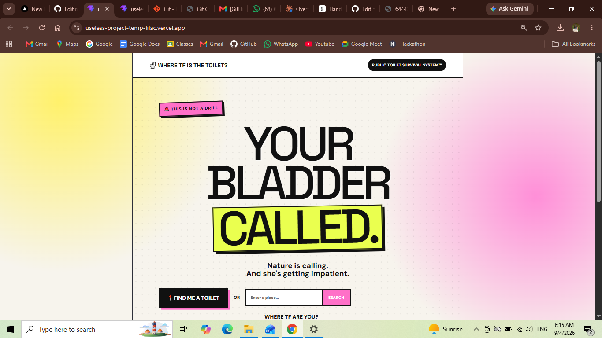
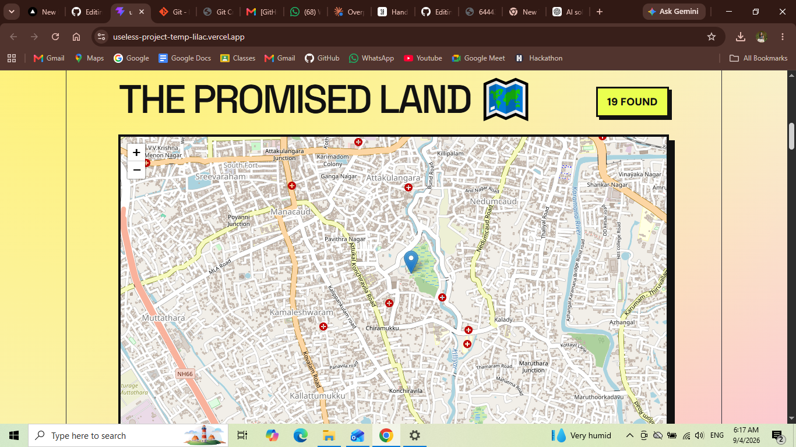
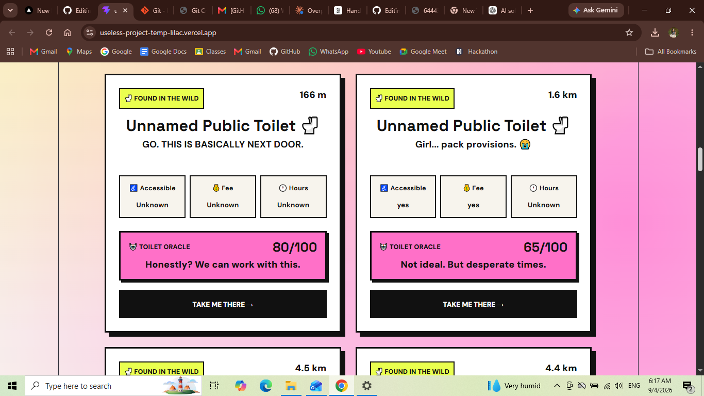

# Where Tf is the Toilet? 🎯

## Basic Details
### Team Name: Code35

### Team Members
- Team Lead: Aadya B Nair - Lbsitw
- Member 2: Ananthita Rajesh - Lbsitw
  

### Project Description
Toilet Finder is a completely unnecessary yet strangely useful website that helps people locate nearby public toilets, check their general condition, and report issues.

Because apparently finding a toilet needed an entire web application.

### The Problem (that doesn't exist)
Have you ever desperately needed a toilet and thought:

"Wow, I wish there was a website for this"

No?

Neither did we.

But we decided to solve this extremely important non-problem anyway.
The real crisis: having to walk around asking random people where the nearest toilet is while Google Maps watches silently.

### The Solution (that nobody asked for)
We built Toilet Finder — a website that lets users find nearby public toilets, view them on a map, check their status, and report problems.

Users can:

- 📍 Find toilets around their location
- 🗺️ View toilets on a map
- 📏 Check approximate distance
- 🟢🟡🔴 Check toilet condition
- 🤖 Receive a completely unnecessary "AI-style" toilet verdict
- 📢 Report issues

Is it necessary?

Absolutely not.

Did we build it anyway?
Absolutely

## Technical Details
### Technologies/Components Used
For Software:
- JavaScript
- HTML
- CSS
- React
- Vite
- Git & GitHub
- VS Code
For Hardware:
None

### Implementation
For Software:
# Installation
Clone the repository and install the dependencies 

git clone [YOUR-GITHUB-REPOSITORY-LINK]
cd [PROJECT-FOLDER]
npm install

# Run
npm run dev

### Project Documentation
For Software:

# Screenshots (Add at least 3)
# Screenshots

*The homepage of Toilet Finder.*

*The map showing nearby toilet locations.*

*Toilet cards showing distance, condition, and toilet status.*

# Diagrams
                ┌─────────────────┐
                │   USER OPENS    │
                │  TOILET FINDER  │
                └────────┬────────┘
                         │
                         ▼
                ┌─────────────────┐
                │  FIND LOCATION  │
                │       📍        │
                └────────┬────────┘
                         │
                         ▼
                ┌─────────────────┐
                │ VIEW NEARBY     │
                │    TOILETS 🗺️   │
                └────────┬────────┘
                         │
                         ▼
                ┌─────────────────┐
                │ CHECK DISTANCE  │
                │ & CONDITION 🚽  │
                └────────┬────────┘
                         │
                    ┌────┴────┐
                    ▼         ▼
              ┌──────────┐ ┌─────────────┐
              │  SELECT  │ │ REPORT AN   │
              │  TOILET  │ │    ISSUE 📢 │
              └────┬─────┘ └──────┬──────┘
                   │              │
                   └──────┬───────┘
                          ▼
                  ┌───────────────┐
                  │  USER FINDS   │
                  │  / REPORTS    │
                  │   TOILET 🚽   │
                  └───────────────┘

### Project Demo
# Video
https://drive.google.com/file/d/1DyTrquPLXhrMM0JprZPZ0Sm2FBzmZ-xT/view?usp=drivesdk
*The working of the user interface part of the site*

# Additional Demos
[Add any extra demo materials/links]

## Team Contributions
- Aadya B Nair: Backend,Frontend developing
- Ananthita Rajesh: Debugging

---
Made with ❤️ at TinkerHub Useless Projects 

